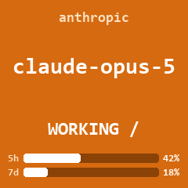
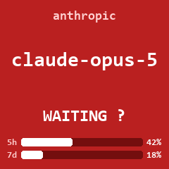
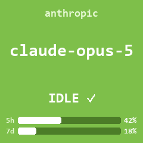

# GeekMagic AI Status

Show which **AI model is working right now** on the screen of a GeekMagic
SmallTV-Ultra, colour-coded by state, with usage bars for your rate-limit
windows. When no AI is active the screen goes back to the stock weather station.

<p align="center">
  
  
  
</p>

| State | Colour | Mark | When |
|---|---|---|---|
| `WORKING` | orange | spinner `/ - \ \|` | the assistant is thinking |
| `WAITING` | red | `?` | it asked you something and is waiting for your answer |
| `IDLE` | green | `✓` | session open but nothing happening |
| — | stock weather station | — | no session active |

The bars show how much of your 5-hour and weekly usage windows you have spent,
to the percentage point. They only appear when that information is available.

`WORKING` is an animated GIF, which the device loops by itself, so a spinner
that turns for an hour still costs a single upload. The tick is drawn with
lines rather than typed, because U+2713 is absent from the monospace fonts this
targets and would come out as an empty box.

## The original firmware is never touched

This is the core constraint of the project, and it is honoured literally: **no
firmware is ever written or modified**. The original configuration pages, the
themes, the weather and every setting stay exactly as they were.

GeekMagic firmware is closed-source and shipped only as a binary, so "adding a
piece" to it was never an option — it could only be replaced. It does not need
to be, because the stock firmware already exposes everything required. These are
the same endpoints its own *Pictures* page uses:

| Endpoint | Purpose |
|---|---|
| `POST /doUpload?dir=/image/` | upload a 240×240 frame |
| `GET /set?img=<path>` | show it full screen |
| `GET /set?theme=<n>` | select the theme (3 = Photo Album) |
| `GET /set?i_i=<s>&autoplay=<0\|1>` | automatic slideshow |
| `GET /filelist?dir=/image` | list files |
| `GET /delete?file=<path>` | delete a file |

Everything this project does you could do by hand from a browser: upload an
image and select it.

> **Official firmware and manuals** live at
> [github.com/GeekMagicClock/smalltv-ultra](https://github.com/GeekMagicClock/smalltv-ultra)
> — that is GeekMagic's own repository, the only place you should get firmware
> from. This project neither ships nor needs it. If you ever do flash from
> there, check the model name first, and be aware that the newest published
> release may be *older* than the firmware your unit shipped with: units are
> going out with 9.0.51 while 9.0.50 is the latest one published.

## How it works

```
Claude Code ──hook──► local daemon ──HTTP──► SmallTV-Ultra
              (127.0.0.1:8787)        (stock firmware)
```

Hooks are throwaway processes that must finish in milliseconds, so they never
talk to the device: they POST to the daemon and exit. The daemon coalesces rapid
changes, draws the frame and sends it.

There is a second, independent detection path. Hooks are loaded when a session
*starts*, so a session that was already open when you installed this would never
fire them. The daemon therefore also watches Claude Code's transcript files,
whose filename is the session id: sessions are picked up straight away, with no
restart at all. The watcher can tell `WORKING` from `IDLE`, but not `WAITING` —
from the outside, a session asking you a question looks exactly like an idle
one. Hooks fill that in when they are available, and always take precedence.

**A frame is uploaded once and then reused.** The filename is a hash of
everything visible on it (provider, model, state, bars); if that frame is
already on the device, only `/set?img=` is called. That matters on an ESP8266,
where flash erase cycles are finite.

Showing the usage bars to the percentage point works against that: every point
of movement is a new frame to upload. It is a deliberate trade — exact numbers
in exchange for a handful of uploads an hour rather than almost none — and
`max_cached_frames` keeps the pile on the device bounded. Set `USAGE_BUCKET` in
`render.py` higher to round the figures and cut the writes.

The spinner does **not** work this way. It is a looping GIF the device animates
by itself; pushing a frame every tenth of a second to animate it would mean
tens of thousands of flash writes an hour.

Because frames are pushed only on a change, what is on screen is remembered
rather than checked, and a device that reboots would come back on its own theme
while the daemon still believed its frame was up — silently, forever. So the
theme is verified every couple of minutes and re-asserted if it has moved. Only
while the daemon is driving the screen: once it has handed it back, whatever is
on it is yours.

## Requirements

- Python 3.10 or newer
- The device already joined to your WiFi
- Pillow — the installer sets it up for you

## Setup

**Windows:** download the project and double-click **`Install.bat`**.

**macOS / Linux:**

```bash
git clone https://github.com/MacheteFlow/GeekMagic-AI-Status.git
cd GeekMagic-AI-Status
python install.py
```

The installer walks through seven steps and asks before doing anything:

1. checks Python and installs Pillow
2. **finds the device on your network by itself** — no IP address to look up
3. writes `config.json`
4. backs up the device (read-only, nothing is modified)
5. connects Claude Code, keeping any hooks and settings you already have
6. optionally starts the daemon at boot
7. shows a test frame and asks whether you saw it

To undo all of it: **`Uninstall.bat`**, or `python uninstall.py`.

### After setup

- Start the daemon with **`Start daemon.bat`** (or `python statusd.py`), unless
  you enabled start-on-boot. It must be running for the screen to change.
- Restart Claude Code.

## Works with other AI tools too

The daemon is not tied to Claude Code. It gathers state from four sources, and
uses whichever gives the best evidence:

| Source | Covers | Can report |
|---|---|---|
| **Hooks** | Claude Code | `WORKING` · `WAITING` · `IDLE` |
| **Transcripts** | Claude Code, incl. sessions already open | `WORKING` · `IDLE` |
| **Applications** | desktop clients and local runners with no events at all | `WORKING` · `IDLE` |
| **HTTP API** | anything you write yourself | everything |

Only an assistant that tells us can report `WAITING`. From outside a process, a
session asking you a question is indistinguishable from an idle one — no amount
of watching files will fix that, so it is not pretended otherwise.

When several are active the most urgent status wins; on a tie the better
evidenced source does, so a guess from file activity never pushes aside a
session being followed properly.

### Application detection

Desktop clients keep their conversations in the cloud and publish no events, so
they are recognised by their process plus the files they touch while replying.
Built in: Claude desktop, ChatGPT desktop, Ollama, LM Studio.

An app counts as open only while it owns a **visible window**. Closing one to
the notification area leaves its process running, and a tray icon is not an AI
session — otherwise the weather would never come back. A window minimised to
the taskbar still counts.

`WORKING` needs the activity file to change **repeatedly** within a few seconds.
A single write proves nothing: these apps touch their storage on their own for a
sync or a notification, and treating one as work reported a busy assistant for
minutes at a time.

Add your own in `config.json`:

```json
{
  "extra_apps": [
    {
      "key": "my-assistant",
      "provider": "acme",
      "model": "Acme Chat",
      "executables": ["acme.exe"],
      "activity": ["C:/Users/me/AppData/Roaming/Acme/IndexedDB/*.leveldb/*"]
    }
  ]
}
```

Choose `activity` paths with care. Many Electron apps rewrite their
`Local Storage` on a timer whether or not anything is happening, which would
report the app as permanently busy; conversation data in `IndexedDB` only moves
during a real exchange. Check a candidate by watching its mtime while the app
sits idle — it should age steadily and never jump back.

### Driving it yourself

```bash
python gmctl.py state --provider openai --model gpt-5 --status working
python adapters/wrap.py --provider openai --model gpt-5 -- codex
```

See **[adapters/README.md](adapters/README.md)** for the full API.

## Manual use and diagnostics

```bash
python gmctl.py info                    # device status, free space, files
python gmctl.py preview --model gpt-5 --status waiting --five-hour 80
python gmctl.py show   --model claude-opus-5 --status working   # writes to device
python gmctl.py state  --model x --status working               # goes via daemon
python gmctl.py status                  # daemon internals
python gmctl.py stock  --theme 1        # back to the weather right now
python gmctl.py gc                      # remove ai_*.jpg frames from the device
```

## Configuration

`config.json`, created by the installer:

| Key | Default | Meaning |
|---|---|---|
| `device_host` | — | IP address of the SmallTV-Ultra |
| `idle_grace_seconds` | `180` | idle time before returning to the weather; `0` = immediately |
| `stock_theme` | `null` | theme to return to; `null` = whatever it was before we started |
| `min_push_interval` | `0.6` | minimum seconds between two screen changes |
| `reconcile_interval` | `120` | how often to check the device really shows our frame; `0` disables |
| `max_cached_frames` | `60` | frames kept on the device before the oldest are dropped |
| `font_path` | `""` | monospace font; empty = first one found on the system |
| `jpeg_quality` | `88` | quality of the still frames |
| `watch_transcripts` | `true` | detect sessions from transcripts, without a restart |
| `watch_working_seconds` | `12` | transcript idle time after which a session counts as idle |

### About the usage bars

They are read from `cachedUsageUtilization` in `~/.claude.json`, which Claude
Code refreshes as it works. That source needs no hooks, no status line and no
restart, so the bars are live from the moment the daemon starts. Only the usage
block is read; the account identifiers alongside it are ignored.

The status line remains a fallback for setups where that file is missing. It
supplies the same figures through `rate_limits`, but only on Claude.ai Pro/Max
plans and only from a session started after it was configured.

If neither source has anything, the bars are simply left off the frame rather
than drawn from a stale number.

## Backup and restore

```bash
python backup_device.py 192.168.1.42       # your device IP
python restore_device.py --dry-run --all   # show what it would do
python restore_device.py --settings        # settings only
python restore_device.py --all             # settings + images
```

### What the backup does not cover

Worth stating plainly, because it is the question that matters:

- **The firmware binary cannot be saved over the network.** ESP8266 OTA is
  one-way: you can write it, not read it. A byte-for-byte dump needs a 3.3V
  USB-UART adapter physically wired up and `esptool read_flash`.
- **The WiFi password** is returned masked (`"****"`) and is not recoverable.
- **The web console pages** can be downloaded (they are stored gzipped, so the
  backup keeps both raw and expanded copies) but not uploaded back:
  `/doUpload` only accepts JPG/GIF into `/image`.
- **Images and settings** are fully restorable.

None of this is a risk in normal use, because the project only ever uploads an
image and selects it — ordinary, reversible operations. The worst case is a
wrong theme, which `restore_device.py` fixes.

## Notes on the device

Gathered by querying a real unit, not from the manual:

- Model `SmallTV-Ultra`, firmware `Ultra-V9.0.51`, **ESP8266**
  (the PRO variant uses an ESP32)
- **TFT IPS ST7789 240×240** display — not OLED, despite what listings often say
- LittleFS partition of 3,121,152 bytes
- The web server truncates responses on large files, so reads must be retried;
  this is why `backup_device.py` never overwrites a complete copy with a partial one
- It handles one connection at a time, so requests are serialised

The official firmware repository is
[GeekMagicClock/smalltv-ultra](https://github.com/GeekMagicClock/smalltv-ultra).
Note that the latest published release there is 9.0.50, while units ship with
9.0.51 — a "restore" would be a downgrade. One more reason this project leaves
the firmware alone.

## Disclaimer

This is an **unofficial, independent hobby project**. It is not affiliated with,
endorsed by, or supported by GeekMagic, Anthropic, or any other company whose
products it talks to. "GeekMagic", "SmallTV", "Claude" and all other trademarks
belong to their respective owners and are used here only to say what the
software is compatible with.

The software is provided **as is, without warranty of any kind**, as set out in
the MIT licence below. You run it at your own risk, and the author accepts no
liability for any damage to your device, your data or your setup.

Things worth understanding before you install it:

- It communicates with a device on your local network and uploads images to it,
  using only the documented functions of that device's own web interface. It
  does **not** modify, flash or replace firmware.
- Writing to flash memory wears it out. This project is deliberately designed to
  minimise that (see the caching and rounding above), but any tool that uploads
  files to an embedded device contributes to that wear.
- It edits your Claude Code `settings.json` to add hooks. It makes a timestamped
  backup first and `uninstall.py` reverses the change, but it is your
  configuration file.
- Modifying or adding software to a device may affect its warranty. That is
  between you and your vendor.
- Nothing here redistributes GeekMagic firmware or software. If you ever need
  the official firmware, get it from
  [GeekMagicClock/smalltv-ultra](https://github.com/GeekMagicClock/smalltv-ultra).

If you disagree with any of this, do not install it.

## Licence

MIT — see [LICENSE](LICENSE).
